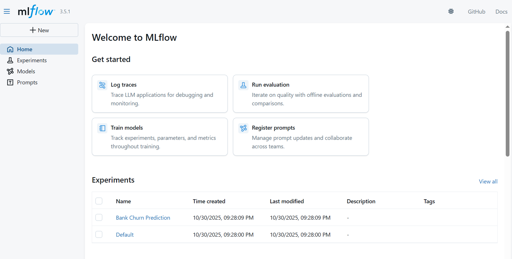

# Bank Customer Churn Prediction with MLflow

A complete end-to-end machine learning project for predicting bank customer churn, featuring experiment tracking with MLflow, model registry, and production-ready REST API deployment.

## Table of Contents

- [Overview](#overview)
- [Features](#features)
- [Project Architecture](#project-architecture)
- [Installation](#installation)
- [Quick Start](#quick-start)
- [Project Structure](#project-structure)
- [Model Performance](#model-performance)
- [API Documentation](#api-documentation)
- [Deployment Scenarios](#deployment-scenarios)
- [MLflow Integration](#mlflow-integration)
- [Configuration](#configuration)
- [Screenshots](#screenshots)
- [Technologies Used](#technologies-used)
- [License](#license)

## Overview

This project demonstrates a production-ready machine learning pipeline that predicts bank customer churn using classification models. It includes comprehensive MLflow integration for experiment tracking, model versioning, and multiple deployment strategies including REST API endpoints.

### Key Capabilities

- Automated data pipeline with Kaggle API integration
- Multiple model comparison (Logistic Regression vs Random Forest)
- Complete MLflow experiment tracking and model registry
- Production-ready REST API with Flask
- Five different deployment scenarios
- A/B testing framework for model comparison
- Batch prediction support

## Features

### Data Processing
- Automated dataset download from Kaggle
- Comprehensive data preprocessing pipeline
- One-hot encoding for categorical variables
- Stratified train-test split (80/20)
- Missing value handling

### Model Training
- Logistic Regression baseline model
- Random Forest ensemble model
- Hyperparameter tracking
- Cross-validation support
- Comprehensive metrics logging

### MLflow Integration
- Experiment tracking with parameters and metrics
- Model registry with version management
- Artifact storage (models, requirements, configurations)
- Model comparison visualization
- Automatic model logging with signatures

### API Deployment
- REST API with Flask
- Single and batch prediction endpoints
- Health check and model information endpoints
- Dynamic model reloading
- Error handling and validation

### Deployment Scenarios
1. Simple deployment with direct prediction
2. Flask API with auto-reload capability
3. Batch prediction for large datasets
4. A/B testing between different models
5. Model version comparison and analysis

## Project Architecture
```
┌─────────────────┐
│  Data Loader    │ ← Kaggle API
└────────┬────────┘
         │
         ▼
┌─────────────────┐
│  Preprocessor   │
└────────┬────────┘
         │
         ▼
┌─────────────────┐
│ Model Trainer   │
└────────┬────────┘
         │
         ▼
┌─────────────────┐
│ MLflow Server   │ → Tracking UI (Port 5000)
└────────┬────────┘
         │
         ▼
┌─────────────────┐
│  REST API       │ → Prediction API (Port 5001)
└─────────────────┘
```

## Installation

### Prerequisites

- Python 3.8 or higher
- Kaggle account and API credentials
- Git

### Setup Instructions

#### 1. Clone the repository
```bash
git clone https://github.com/YOUR_USERNAME/MLflow_bank_churn.git
cd MLflow_bank_churn
```

#### 2. Create virtual environment
```bash
# Create virtual environment
python -m venv venv

# Activate virtual environment
# On Windows:
.\venv\Scripts\Activate.ps1

# On Linux/Mac:
source venv/bin/activate
```

#### 3. Install dependencies
```bash
pip install -r requirements.txt
```

#### 4. Configure Kaggle API

Download your `kaggle.json` from https://www.kaggle.com/settings and place it in:
- Windows: `C:\Users\<username>\.kaggle\kaggle.json`
- Linux/Mac: `~/.kaggle/kaggle.json`

Ensure proper permissions (Linux/Mac):
```bash
chmod 600 ~/.kaggle/kaggle.json
```

## Quick Start

### Training Models

#### Option 1: Using the main training script
```bash
python bank_churn.py
```

This will:
1. Download the dataset from Kaggle
2. Preprocess the data
3. Train both Logistic Regression and Random Forest models
4. Log all experiments to MLflow
5. Register models in the Model Registry

#### Option 2: Using the modular training script
```bash
python scripts/train.py
```

### Starting Services

#### 1. Start MLflow Tracking Server
```bash
mlflow server --host 127.0.0.1 --port 5000
```

Access the MLflow UI at: http://localhost:5000

#### 2. Start REST API Server
```bash
python scripts/api_server.py
```

API will be available at: http://localhost:5001

#### 3. Run Deployment Scenarios
```bash
python scripts/model_deployment_scenarios.py
```

This demonstrates all five deployment scenarios with interactive prompts.

## Project Structure
```
MLflow_bank_churn/
├── bank_churn.py                  # Main training script
├── requirements.txt               # Python dependencies
├── README.md                      # Project documentation
├── .gitignore                     # Git ignore rules
├── config/
│   └── config.yaml               # Configuration file
├── src/
│   ├── data_loader.py            # Kaggle data download
│   ├── preprocessor.py           # Data preprocessing
│   ├── model_trainer.py          # Model training logic
│   └── mlflow_server.py          # MLflow server management
├── scripts/
│   ├── train.py                  # Modular training pipeline
│   ├── api_server.py             # REST API server
│   └── model_deployment_scenarios.py  # Deployment examples
├── screenshots/
│   ├── MLflow_homepage.png      # MLflow UI home
│   └── MLflow_comparing.png      # Model comparison
├── notebooks/                     # Jupyter notebooks
└── tests/                         # Unit tests
```

## Model Performance

### Comparison Results

| Model | Accuracy | Precision | Recall | F1 Score |
|-------|----------|-----------|--------|----------|
| Logistic Regression | 83.36% | 68.98% | 38.79% | 49.66% |
| Random Forest | 86.30% | 76.19% | 51.27% | 61.30% |

### Key Findings

- **Random Forest** shows 2.94% improvement in accuracy over Logistic Regression
- **Random Forest** demonstrates 23.43% improvement in F1 score
- Random Forest achieves better precision (76.19% vs 68.98%)
- Random Forest shows superior recall (51.27% vs 38.79%)

**Recommended Model**: Random Forest for production deployment

### Feature Importance (Random Forest)

Top predictive features:
1. Age
2. Number of Products
3. Balance
4. Credit Score
5. Estimated Salary

## API Documentation

### Base URL
```
http://localhost:5001
```

### Endpoints

#### Health Check
```http
GET /
```

**Response:**
```json
{
  "status": "running",
  "message": "Bank Churn Prediction API",
  "model": {
    "name": "BankChurnRandomForest",
    "version": "8",
    "stage": "None",
    "loaded_at": "2025-10-31T03:19:36.306325"
  }
}
```

#### Model Information
```http
GET /model-info
```

**Response:**
```json
{
  "version": "8",
  "stage": "None",
  "run_id": "114577e72dd44007b804b66112834599",
  "model_uri": "models:/BankChurnRandomForest/8"
}
```

#### Single Prediction
```http
POST /predict
Content-Type: application/json
```

**Request Body:**
```json
{
  "CreditScore": 750.0,
  "Age": 45.0,
  "Tenure": 10.0,
  "Balance": 100000.0,
  "NumOfProducts": 3.0,
  "HasCrCard": 1.0,
  "IsActiveMember": 1.0,
  "EstimatedSalary": 90000.0,
  "Geography_Germany": 0.0,
  "Geography_Spain": 0.0,
  "Gender_Male": 1.0
}
```

**Response:**
```json
{
  "prediction": 0,
  "prediction_label": "WILL STAY",
  "model_version": "8",
  "confidence": "Model provides binary classification without probability",
  "timestamp": "2025-10-31T03:39:34.099669"
}
```

#### Batch Prediction
```http
POST /batch-predict
Content-Type: application/json
```

**Request Body:**
```json
[
  {
    "CreditScore": 750.0,
    "Age": 45.0,
    ...
  },
  {
    "CreditScore": 400.0,
    "Age": 25.0,
    ...
  }
]
```

#### Reload Model
```http
POST /reload-model
```

Reloads the latest model version without server restart.

### Example Usage

#### Python
```python
import requests

# Single prediction
data = {
    "CreditScore": 750.0,
    "Age": 45.0,
    "Tenure": 10.0,
    "Balance": 100000.0,
    "NumOfProducts": 3.0,
    "HasCrCard": 1.0,
    "IsActiveMember": 1.0,
    "EstimatedSalary": 90000.0,
    "Geography_Germany": 0.0,
    "Geography_Spain": 0.0,
    "Gender_Male": 1.0
}

response = requests.post(
    "http://localhost:5001/predict",
    json=data
)

print(response.json())
```

#### cURL
```bash
curl -X POST http://localhost:5001/predict \
  -H "Content-Type: application/json" \
  -d '{
    "CreditScore": 750.0,
    "Age": 45.0,
    "Tenure": 10.0,
    "Balance": 100000.0,
    "NumOfProducts": 3.0,
    "HasCrCard": 1.0,
    "IsActiveMember": 1.0,
    "EstimatedSalary": 90000.0,
    "Geography_Germany": 0.0,
    "Geography_Spain": 0.0,
    "Gender_Male": 1.0
  }'
```

## Deployment Scenarios

The project includes five comprehensive deployment scenarios:

### Scenario 1: Simple Deployment

Direct model loading and prediction for quick testing and development.
```python
from scripts.model_deployment_scenarios import scenario_1_simple_deployment
scenario_1_simple_deployment()
```

### Scenario 2: Flask API with Auto-Reload

Production-ready API server with dynamic model reloading capability.
```python
from scripts.model_deployment_scenarios import scenario_2_flask_api
app = scenario_2_flask_api()
app.run(host='0.0.0.0', port=5001)
```

### Scenario 3: Batch Prediction

Efficient processing of large customer datasets with CSV output.
```python
from scripts.model_deployment_scenarios import scenario_3_batch_prediction
results = scenario_3_batch_prediction()
```

### Scenario 4: A/B Testing

Compare predictions between different models to evaluate business impact.
```python
from scripts.model_deployment_scenarios import scenario_4_ab_testing
comparison = scenario_4_ab_testing()
```

### Scenario 5: Version Comparison

Analyze differences between model versions to track improvement over time.
```python
from scripts.model_deployment_scenarios import scenario_5_version_comparison
scenario_5_version_comparison()
```

## MLflow Integration

### Experiment Tracking

All training runs are logged to MLflow with:

- **Parameters**: Model hyperparameters, data split ratios, random seeds
- **Metrics**: Accuracy, precision, recall, F1 score
- **Artifacts**: Trained models, requirements.txt, environment specifications
- **Tags**: Model type, dataset version, training date

### Model Registry

Models are registered with versioning:

- **Model Names**:
  - `BankChurnLogisticRegression`
  - `BankChurnRandomForest`
- **Versioning**: Automatic version incrementation
- **Staging**: Support for None, Staging, Production, Archived stages
- **Model Signatures**: Input/output schema validation

### Accessing MLflow UI
```bash
mlflow server --host 127.0.0.1 --port 5000
```

Navigate to http://localhost:5000 to:
- View experiment runs
- Compare model metrics
- Visualize parameter relationships
- Download model artifacts
- Manage model versions

## Configuration

### config/config.yaml
```yaml
mlflow:
  tracking_uri: "http://127.0.0.1:5000"
  experiment_name: "Bank Churn Prediction"

models:
  logistic_regression:
    max_iter: 1000
    random_state: 42
  
  random_forest:
    n_estimators: 100
    max_depth: 10
    random_state: 42

data:
  test_size: 0.2
  random_state: 42
```

## Screenshots

### MLflow Home Page


The MLflow tracking interface showing all experiment runs for the Bank Churn Prediction project.

### Model Comparison


Parallel coordinates plot comparing hyperparameters and metrics across Logistic Regression and Random Forest models.

## Technologies Used

### Core Technologies

- **Python 3.11** - Programming language
- **MLflow 2.x** - Experiment tracking and model registry
- **scikit-learn** - Machine learning algorithms
- **Flask** - REST API framework

### Data Processing

- **pandas** - Data manipulation and analysis
- **numpy** - Numerical computing
- **kagglehub** - Kaggle dataset integration

### Model Evaluation

- **scikit-learn metrics** - Model evaluation metrics
- **matplotlib** - Visualization (optional)
- **seaborn** - Statistical visualization (optional)

## Dataset

**Source**: Kaggle - Bank Churn Dataset

**Features** (11 total after preprocessing):
- CreditScore (continuous)
- Age (continuous)
- Tenure (continuous)
- Balance (continuous)
- NumOfProducts (discrete)
- HasCrCard (binary)
- IsActiveMember (binary)
- EstimatedSalary (continuous)
- Geography_Germany (binary, one-hot encoded)
- Geography_Spain (binary, one-hot encoded)
- Gender_Male (binary, one-hot encoded)

**Target Variable**: Exited (0 = Stayed, 1 = Churned)

## Testing

Run the complete test suite:
```bash
pytest tests/
```

Run specific test categories:
```bash
# Unit tests
pytest tests/unit/

# Integration tests
pytest tests/integration/

# API tests
pytest tests/api/
```

## Contributing

Contributions are welcome. Please follow these steps:

1. Fork the repository
2. Create a feature branch (`git checkout -b feature/AmazingFeature`)
3. Commit your changes (`git commit -m 'Add some AmazingFeature'`)
4. Push to the branch (`git push origin feature/AmazingFeature`)
5. Open a Pull Request

## License

This project is licensed under the MIT License - see the LICENSE file for details.

## Acknowledgments

- Dataset provided by Kaggle community
- MLflow documentation and examples
- scikit-learn documentation
- Flask framework documentation

## Contact

Project Link: https://github.com/YOUR_USERNAME/MLflow_bank_churn

## Future Enhancements

- [ ] Add XGBoost and LightGBM models
- [ ] Implement SHAP values for model interpretability
- [ ] Add monitoring and alerting for API
- [ ] Implement authentication for API endpoints
- [ ] Add Docker containerization
- [ ] Create CI/CD pipeline with GitHub Actions
- [ ] Add more comprehensive unit tests
- [ ] Implement model performance monitoring dashboard
