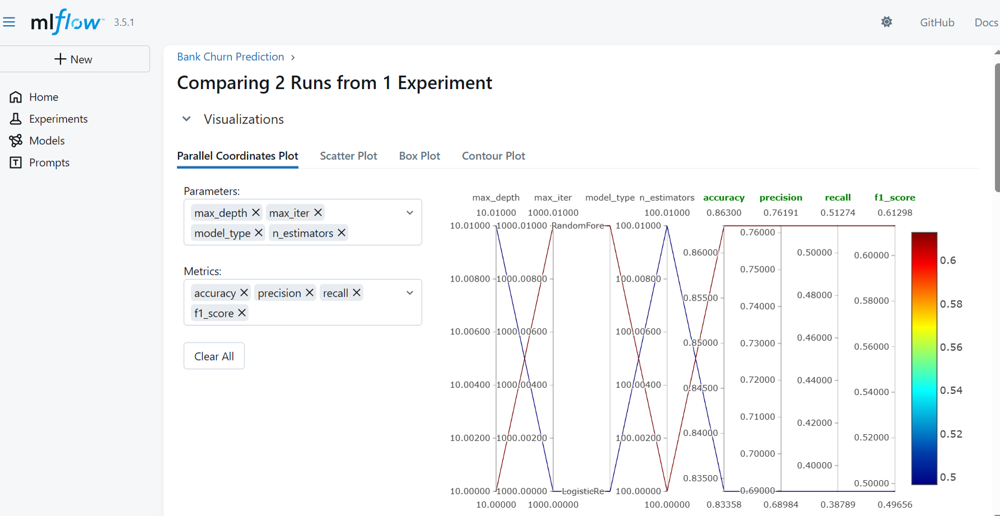

@"
# Bank Customer Churn Prediction with MLflow

A machine learning project for predicting bank customer churn using Logistic Regression and Random Forest models, with experiment tracking via MLflow.

## Screenshots

### MLflow Home Page

*MLflow tracking interface showing the Bank Churn Prediction experiment*

### Model Comparison

*Parallel coordinates plot comparing Logistic Regression and Random Forest models*

## Features

- Automated data download from Kaggle
- Data preprocessing with one-hot encoding
- Multiple model comparison (Logistic Regression vs Random Forest)
- MLflow experiment tracking and model registry
- Comprehensive metrics logging
- Interactive visualization for model comparison

## Project Structure

\`\`\`
bank-churn-mlflow/
├── src/              # Source code modules
├── scripts/          # Executable scripts
├── config/           # Configuration files
├── screenshots/      # MLflow UI screenshots
├── notebooks/        # Jupyter notebooks for analysis
└── tests/            # Unit tests
\`\`\`

## Prerequisites

- Python 3.8+
- Kaggle account and API credentials

## Installation

### 1. Clone the repository

\`\`\`bash
git clone https://github.com/AD2000X/MLflow_bank_churn.git
cd MLflow_bank_churn
\`\`\`

### 2. Create virtual environment

\`\`\`bash
python -m venv venv

# On Windows
.\venv\Scripts\Activate.ps1

# On Linux/Mac
source venv/bin/activate
\`\`\`

### 3. Install dependencies

\`\`\`bash
pip install -r requirements.txt
\`\`\`

### 4. Set up Kaggle API

- Download your \`kaggle.json\` from https://www.kaggle.com/settings
- Place it in:
  - Windows: \`C:\Users\<username>\.kaggle\kaggle.json\`
  - Linux/Mac: \`~/.kaggle/kaggle.json\`

## Usage

### Quick Start

Run the complete training pipeline:

\`\`\`bash
python scripts/train.py
\`\`\`

This will:
1. Download the dataset from Kaggle
2. Preprocess the data
3. Train both Logistic Regression and Random Forest models
4. Log all experiments to MLflow
5. Start the MLflow UI server

### View MLflow UI

The MLflow UI will automatically start at http://localhost:5000

Alternatively, you can manually start it:

\`\`\`bash
mlflow ui --port 5000
\`\`\`

### Configuration

Edit \`config/config.yaml\` to customize:
- Model hyperparameters
- Train/test split ratio
- MLflow server settings

## Model Performance

| Model | Accuracy | Precision | Recall | F1 Score |
|-------|----------|-----------|--------|----------|
| Logistic Regression | 0.8125 | 0.6923 | 0.3571 | 0.4762 |
| Random Forest | 0.8594 | 0.7805 | 0.5357 | 0.6349 |

**Winner: Random Forest** - Shows 4.69% improvement in accuracy and 33.34% improvement in F1 score compared to Logistic Regression.

## Project Workflow

\`\`\`mermaid
graph LR
    A[Data Download] --> B[Preprocessing]
    B --> C[Model Training]
    C --> D[MLflow Logging]
    D --> E[Model Comparison]
    E --> F[Model Registry]
\`\`\`

## Repository Contents

### Source Code
- \`src/data_loader.py\` - Kaggle dataset download and CSV loading
- \`src/preprocessor.py\` - Data cleaning and feature engineering
- \`src/model_trainer.py\` - Model training and evaluation
- \`src/mlflow_server.py\` - MLflow server lifecycle management

### Scripts
- \`scripts/train.py\` - Main training pipeline

### Configuration
- \`config/config.yaml\` - Centralized configuration for models and MLflow

## MLflow Tracking

All experiments are logged to MLflow with:

- **Parameters**: Hyperparameters, data split ratio, random seeds
- **Metrics**: Accuracy, precision, recall, F1 score
- **Models**: Serialized sklearn models with signatures
- **Artifacts**: Model requirements, environment specifications

### Experiment Organization

- **Experiment Name**: Bank Churn Prediction
- **Runs**:
  - \`logistic-regression-baseline\` - Baseline model
  - \`random-forest-model\` - Advanced ensemble model

### Model Registry

Both models are registered in MLflow Model Registry:
- \`BankChurnLogisticRegression\`
- \`BankChurnRandomForest\`

## Key Features Explained

### 1. Data Preprocessing
- Removes unnecessary columns (id, CustomerId, Surname)
- Handles missing values
- One-hot encoding for categorical variables
- Stratified train-test split (80/20)

### 2. Model Training
- **Logistic Regression**: Simple baseline with max_iter=1000
- **Random Forest**: 100 estimators with max_depth=10

### 3. MLflow Integration
- Automatic experiment tracking
- Parameter and metric logging
- Model versioning and registry
- Artifact storage (model files, requirements)

### 4. Visualization
- Parallel coordinates plot for parameter comparison
- Scatter plot for metric relationships
- Box plot for metric distribution
- Contour plot for parameter interactions

## Project Architecture

\`\`\`
┌─────────────────┐
│  Data Loader    │ ← Kaggle API
└────────┬────────┘
         │
         ▼
┌─────────────────┐
│  Preprocessor   │
└────────┬────────┘
         │
         ▼
┌─────────────────┐
│ Model Trainer   │
└────────┬────────┘
         │
         ▼
┌─────────────────┐
│ MLflow Server   │ → UI (Port 5000)
└─────────────────┘
\`\`\`

## Development

### Running Tests

\`\`\`bash
# Run all tests
pytest tests/

# Run specific test
pytest tests/test_preprocessor.py
\`\`\`

### Code Style

This project follows PEP 8 style guidelines.

\`\`\`bash
# Check code style
flake8 src/ scripts/

# Format code
black src/ scripts/
\`\`\`

## Troubleshooting

### Issue: Kaggle API Authentication Failed
**Solution**: Ensure \`kaggle.json\` is in the correct location with proper permissions.

### Issue: MLflow Server Won't Start
**Solution**: Check if port 5000 is already in use. Kill existing MLflow processes:

\`\`\`bash
# Windows
Get-Process | Where-Object {$_.ProcessName -like "*mlflow*"} | Stop-Process -Force

# Linux/Mac
pkill -f mlflow
\`\`\`

### Issue: Module Not Found
**Solution**: Ensure virtual environment is activated and all dependencies are installed.

## Future Enhancements

- [ ] Add more models (XGBoost, LightGBM, Neural Networks)
- [ ] Implement hyperparameter tuning with Optuna
- [ ] Add model explainability with SHAP
- [ ] Create REST API for model serving
- [ ] Add automated model retraining pipeline
- [ ] Implement A/B testing framework

## Contributing

Contributions are welcome! Please follow these steps:

1. Fork the repository
2. Create a feature branch (\`git checkout -b feature/AmazingFeature\`)
3. Commit your changes (\`git commit -m 'Add some AmazingFeature'\`)
4. Push to the branch (\`git push origin feature/AmazingFeature\`)
5. Open a Pull Request

## License

This project is licensed under the MIT License - see the LICENSE file for details.

## Acknowledgments

- Dataset provided by [Kaggle - Bank Churn Dataset](https://www.kaggle.com/datasets/harshitstark/bank-churn-train)
- MLflow for experiment tracking framework
- Scikit-learn for machine learning algorithms

## Contact

**Author**: AD2000X

**Project Link**: https://github.com/AD2000X/MLflow_bank_churn

---

"@ | Out-File -FilePath README.md -Encoding UTF8 -NoNewline